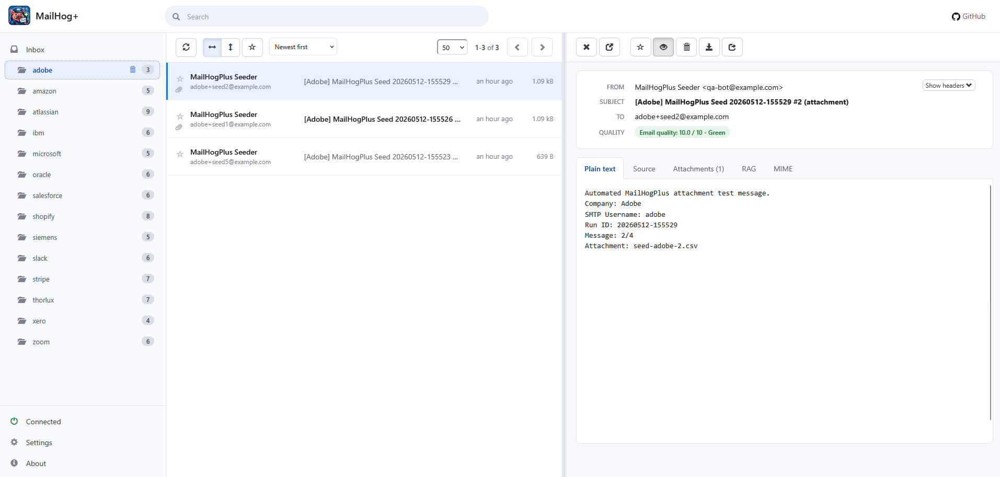

<p align="center">
  
</p>

# MailHogPlus

MailHogPlus is a maintained fork of MailHog focused on professional engineering workflows.  
It provides a controlled email testing environment for development, QA, and platform teams, with mailbox routing, quality scoring, and release-to-SMTP controls.

## Why MailHogPlus

MailHogPlus helps teams validate outbound email safely before production delivery:

- Capture all outbound email in a local or shared non-production environment
- Route mail into team folders using SMTP username conventions
- Review email quality with built-in RAG scoring and delivery guidance
- Release approved messages through preconfigured SMTP relays
- Manage storage and retention from a central settings page

## Platform Highlights

| Capability | Value |
| --- | --- |
| Multi-pane operations UI | Faster review with folders, list, and preview workspace modes |
| SMTP username folder routing | Team-specific inbox segmentation without app changes |
| Outgoing SMTP release profiles | Controlled release path to real mail servers |
| Email quality scoring (RAG) | Earlier detection of content and structure risks |
| Configurable storage and retention | Align test infrastructure with environment requirements |
| HTTP API + WebSocket updates | Automation and real-time integration support |

## Quick Start

### 1) Build

```bash
git clone <your-repository-url>
cd MailHogPlus-Main
go build -o mailhogplus .
```

### 2) Run

```bash
./mailhogplus
```

Open the UI at: `http://localhost:8025`  
Route application SMTP traffic to: `localhost:1025`

## Configuration

Default behavior:

- SMTP listener: `1025`
- HTTP API/UI listener: `8025`
- Storage mode: `maildir` (path: `mailhogplus-data`)

Use [docs/CONFIG.md](docs/CONFIG.md) for full runtime options and environment variables.

Settings persistence:

- Template: [mailhogplus-settings.example.json](mailhogplus-settings.example.json)
- Runtime file: `mailhogplus-settings.json` (git-ignored)

Outgoing relay policy:

- Configure outgoing SMTP servers in the **Settings** page
- The release action is available when at least one outgoing SMTP server is configured

### Folder and Tag Routing

MailHogPlus routes incoming email based on SMTP username:

- `folder` routes to a folder with that name
- `folder:tag1:tag2` routes to the folder and stores tags

Message metadata headers:

- `X-MailHogPlus-Folder`
- `X-MailHogPlus-Tags` (preferred)
- `X-MailHogPlus-Tag` (legacy, still supported)

UI behavior:

- The tag filter applies to both inbox/folder views and search results
- If a tag filter has no matches, the message list shows `No results found for this filter.`

## Web UI



## API and Integrations

- API v1 reference: [docs/APIv1.md](docs/APIv1.md)
- API v2 reference: [docs/APIv2.md](docs/APIv2.md)
- Authentication: [docs/Auth.md](docs/Auth.md)
- Chaos testing (Jim): [docs/JIM.md](docs/JIM.md)
- Client libraries: [docs/LIBRARIES.md](docs/LIBRARIES.md)

## sendmail Integration

[mhsendmail](https://github.com/mailhog/mhsendmail) can route local sendmail workflows through MailHogPlus.

Example:

```bash
/usr/sbin/sendmail -S mail:1025
```

PHP example (`php.ini`):

```ini
sendmail_path = /usr/local/bin/mhsendmail
sendmail_path = /usr/sbin/sendmail -S mail:1025
```

## Development Workflow

Build and install:

```bash
make combined
```

Local development module mode:

```bash
make combined-dev
```

Vendor production dependencies:

```bash
make vendor-prod
```

Testing and formatting:

```bash
go test ./...
go fmt ./...
```

## Project Lineage

MailHogPlus is based on:

- [mailhog/MailHog](https://github.com/mailhog/MailHog)
- [ian-kent/MailHog](https://github.com/ian-kent/MailHog)
- [ian-kent/M3MTA](https://github.com/ian-kent/M3MTA)

## Contributing

See [docs/BUILD.md](docs/BUILD.md) for build and packaging instructions.

## License

Released under MIT. See [LICENSE.md](LICENSE.md).

Upstream copyright notices are preserved.
Additional fork copyright (c) 2026 Integrate IT.
